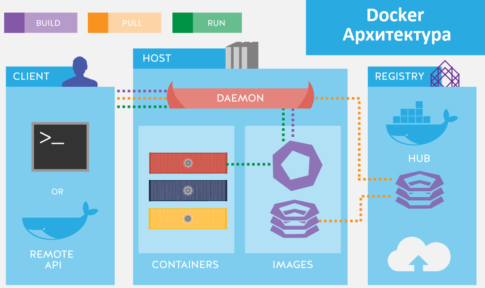

# :whale: Docker 

## :pushpin: Основные понятия:
| Docker | Это открытая платформа, которая позволяет автоматизировать развертывание, масштабирование и управление приложениями с помощью контейнеризации. Контейнеры Docker представляют собой легковесные и изолированные окружения, в которых можно запускать приложения и их зависимости. |
| :---: | :---: |
| **Docker контейнеры** | Представляют собой исполняемые единицы программного обеспечения, которые включают в себя все необходимое для запуска приложения, включая код, системные библиотеки, среду выполнения и зависимости. Контейнеры обеспечивают изоляцию и портативность, что позволяет запускать приложения в любой среде, где установлен Docker. |
| **Образы Docker (Docker Image)** | Являются шаблонами для создания контейнеров. Они содержат все необходимые компоненты, включая операционную систему, приложение и его зависимости. Образы можно создавать самостоятельно или использовать готовые образы, доступные в Docker Hub - центральном репозитории образов Docker. |
| **Docker daemon (dockerd)** | Это основной компонент Docker, который отвечает за управление контейнерами и выполнение команд Docker. Он работает как фоновый процесс на хостовой операционной системе и прослушивает API запросы от Docker клиента. |
| **Docker Hub/ Docker registry**  | Это облачный репозиторий образов Docker, где разработчики могут делиться своими образами и использовать образы, созданные другими сообществами. Docker Hub также предоставляет функциональность для автоматической сборки и публикации образов из репозиториев кода, таких как GitHub. |
| **Dockerfile**        | Это текстовый файл, в котором определяется конфигурация образа Docker. В Dockerfile вы указываете инструкции для создания образа, такие как установка зависимостей, копирование файлов, настройка сети и другие операции. Затем Dockerfile используется для создания образа с помощью команды docker build. |
| **Docker Compose**    | Это инструмент для определения и управления многоконтейнерными приложениями. С помощью файла конфигурации YAML вы можете определить несколько контейнеров, их зависимости и настройки сети. Затем Docker Compose позволяет легко запускать и остановить все контейнеры одной командой. |




## :dart: Чем Docker отличается от виртуальной машины (виртуалки):
**В целом, Docker предоставляет более легковесный и гибкий подход к развертыванию и управлению приложениями, в то время как виртуальные машины обеспечивают полную изоляцию и независимость операционных систем. Выбор между Docker и виртуалками зависит от конкретных требований вашего проекта.**
| Уровень изоляции | Виртуальные машины полностью эмулируют аппаратное обеспечение и каждая виртуальная машина имеет свою собственную операционную систему. Docker использует контейнеризацию, которая позволяет запускать приложения в изолированных контейнерах, но все контейнеры используют общую операционную систему хоста. Это делает контейнеры более легковесными и быстрыми в запуске по сравнению с виртуалками. |
| :---: | :---: |
| **Уровень изоляции** | Виртуальные машины полностью эмулируют аппаратное обеспечение и каждая виртуальная машина имеет свою собственную операционную систему. Docker использует контейнеризацию, которая позволяет запускать приложения в изолированных контейнерах, но все контейнеры используют общую операционную систему хоста. Это делает контейнеры более легковесными и быстрыми в запуске по сравнению с виртуалками. |
| **Ресурсы** | Виртуальные машины требуют выделения отдельных ресурсов, таких как память и процессорное время, для каждой виртуальной машины. Docker контейнеры используют общие ресурсы хоста, что делает их более эффективными в использовании ресурсов. |
| **Размер и скорость** | Виртуальные машины обычно занимают гигабайты дискового пространства и требуют значительного времени для запуска. Docker контейнеры, с другой стороны, могут быть гораздо меньше и запускаться практически мгновенно. |
| **Управление** | Docker предоставляет инструменты для управления контейнерами, такими как Docker CLI и Docker Compose. Виртуальные машины требуют отдельного управления каждой виртуальной машиной, например, с помощью гипервизора или оркестратора виртуальных машин. |
| **Портативность** | Docker контейнеры являются портативными и могут быть запущены на любой системе, поддерживающей Docker. Виртуальные машины, с другой стороны, требуют наличия гипервизора, который может быть разным для разных операционных систем. |


## :computer: Инструкция по установке Docker на Linux:
```ruby
$ apt-get update                       # Обновляемся
$ apt-get install apt-transport-https  # Устанавливаем https протокол
$ curl -fsSL https://download.docker.com/linux/ubuntu/gpg | sudo apt-key add  # Добавить ключ
$ add-apt-repository "deb [arch=amd64] https://download.docker.com/linux/ubuntu $(lsb_release -cs) stable"  # Актуализировать версию
$ apt-get update                 # Ещё раз обновляемся
$ apt-get install docker-ce      # Устанавливаем docker
$ systemctl status docker        # Проверяем процесс докера
$ sudo usermod -aG docker $USER  # Можно добавить юзера, как рута (optional)
```

## :green_book: Основные команды для работы с контейнерами:
```ruby
$ docker pull nginx               # Загрузка образа Docker из репозитория Docker Hub или другого репозитория
$ docker run -d -p 8080:80 nginx  # Создание и запуск контейнера на основе определенного образа Docker
$ docker run -it -p 8080 nginx    # Запустить контейнер it(интерактивно в консоли), p(порт веб-сервера 8080)
http://192.168.197.128:8080/      # Идём тестить в браузер (ip вставляем ваш)
$ docker ps                       # Вывести писок запущенных контейнеров
$ docker ps -a                    # Показать "контейнеры", которые были запущены
$ docker start {CONTAINER_ID}     # Запустить контейнер
$ docker start -a {CONTAINER_ID}  # Запустить контейнер и сразу смотреть по нему логи
$ docker stop {CONTAINER_ID}      # Остановка запущенного контейнера
$ docker stop $(docker ps -a -q)  # Остановить все контейнеры
$ docker kill {CONTAINER_ID}      # Резко остановить контейнер
$ docker rm {CONTAINER_ID}        # Удалить контейнер
$ docker logs {CONTAINER_ID}      # Посмотреть логи контейнера
$ docker inspect {CONTAINER_ID}   # Посмотреть подробную информацию о контейнере
$ docker pause {CONTAINER_ID}     # Остановить выполнение контейнера
$ docker unpause {CONTAINER_ID}   # Восстановить выполнение контейнера
$ docker attach {CONTAINER_ID}    # Присоединение к запущенному контейнеру и взаимодействие с ним
$ docker top {CONTAINER_ID}       # Посмотреть процессы, выполняющиеся внутри контейнера
$ docker stats {CONTAINER_ID}     # Посмотреть статистику использования ресурсов контейнера
$ docker-compose up               # Управление множеством контейнеров с помощью файла docker-compose.yml
$ docker exec -it {CONTAINER_ID} command   # Выполнить команду внутри запущенного контейнера
$ docker rename {CONTAINER_ID} {NEW_NAME}  # Переименовать контейнер
$ docker update --cpus 2 {CONTAINER_ID}    # Обновить настройки контейнера во время его выполнения
$ docker cp {CONTAINER_ID}:/path/to/file /host/path  # Копировать файлы между контейнером и хостовой машиной
```


## :blue_book: Основные команды для работы с образами:
```ruby
$ docker run {IMAGE_NAME}     # Запустить/скачать docker контейнер на основе определенного образа
$ docker images               # Показать образы, которые есть
$ docker search {IMAGE_NAME}  # Произвести поиск образа в консоли по Docker-Hub
$ docker pull   {IMAGE_NAME}  # Скачать образ
$ docker push   {IMAGE_NAME}  # Загрузить образ в Docker-Hub (Либо $ docker push username/repository:tag)
$ docker rmi    {IMAGE_NAME}  # Удалить образ
$ docker build -t {IMAGE_NAME} {path-to-dockerfile}   # Создать образ из Dockerfile (./path/to/dockerfile)
$ docker tag image_id new_image_name:new_tag          # Присвоение тега (метки) Docker образу
$ docker save -o image.tar image_id                   # Сохранение Docker образа в архивный файл
$ docker load -i image.tar                            # Загрузка образа Docker из архивного файла
$ docker history {IMAGE_NAME}                         # Посмотреть историю слоев Docker образа
```

## :chart_with_upwards_trend: Основные команды для работы с сетью:
```ruby
$ docker network ls                # Посмотреть сети подключения докера
$ lsof -i -P -n  | grep docker     # Посмотреть открытые порты докера
$ docker network create mynetwork  # Создание новой сети Docker
$ docker network inspect {NETWORK_ID}                    # Получение подробной информации о сети Docker
$ docker network connect {NETWORK_ID} {CONTAINER_ID}     # Подключение контейнера к сети Docker
$ docker network disconnect {NETWORK_ID} {CONTAINER_ID}  # Отключение контейнера от сети Docker
$ docker network rm {NETWORK_ID}  # Удаление сети Docker
$ docker network prune            # Удаление неиспользуемых сетей Docker
$ docker run --network {NETWORK_ID} {IMAGE_NAME}             # Запуск контейнера с присоединением к определенной сети Docker
$ docker network create --driver bridge mynetwork            # Создание сети Docker с определенным драйвером
$ docker network inspect --format '{{.Name}}' {NETWORK_ID}   # Получение определенной информации о сети Docker в определенном формате
```


## :scroll: Пример Dockerfile:
```ruby
# Используем базовый образ Ubuntu
FROM ubuntu:latest

# Устанавливаем необходимые пакеты
RUN apt-get update && apt-get install -y \
    python3 \
    python3-pip

# Копируем файлы в контейнер
COPY . /app

# Устанавливаем зависимости
RUN pip3 install -r /app/requirements.txt

# Определяем рабочую директорию
WORKDIR /app

# Определяем команду, которая будет выполняться при запуске контейнера
CMD ["python3", "app.py"]
```

```docker build -t my-app .``` - Собираем Docker образ

```docker run -d -p 8080:8080 my-app``` - Запускаем контейнер

Теперь приложение будет доступно по адресу http://localhost:8080


## :scroll: Пример docker-compose файла:
```ruby
version: '3'
services:
  web:  # Первый сервис
    build: .
    ports:
      - "8000:8000"
    volumes:
      - .:/app
    depends_on:
      - db
  db:  # Второй сервис
    image: mysql:5.7
    environment:
      - MYSQL_ROOT_PASSWORD=secret
      - MYSQL_DATABASE=mydatabase
```

В этом примере у нас есть два сервиса: `web` и `db`. Сервис `web` основан на собранном образе, который находится в текущей директории.
Он также привязан к порту `8000` и объединяет текущую директорию с `/app` внутри контейнера.
`web` также зависит от сервиса `db`, что означает, что контейнер базы данных должен быть запущен перед запуском контейнера веб-сервера.

Сервис `db` использует образ MySQL версии 5.7 и устанавливает несколько переменных окружения для настройки базы данных.
Чтобы запустить этот `docker-compose` файл, вам нужно выполнить команду `docker-compose up` в директории, где находится этот файл. `Docker-compose` затем создаст и запустит контейнеры, описанные в файле.


